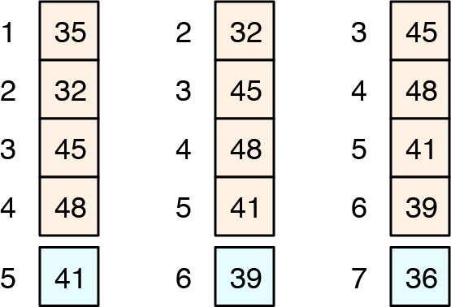
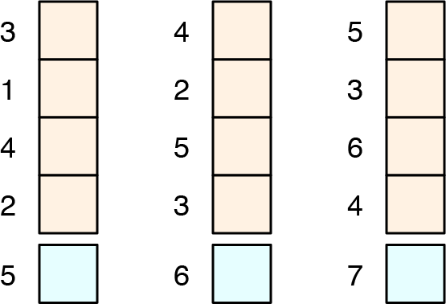
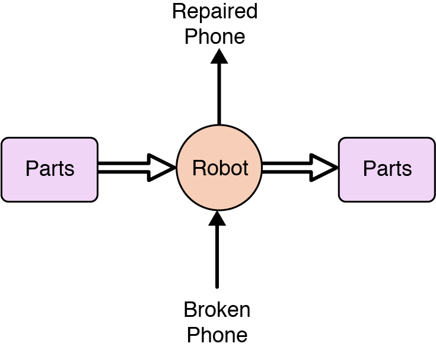
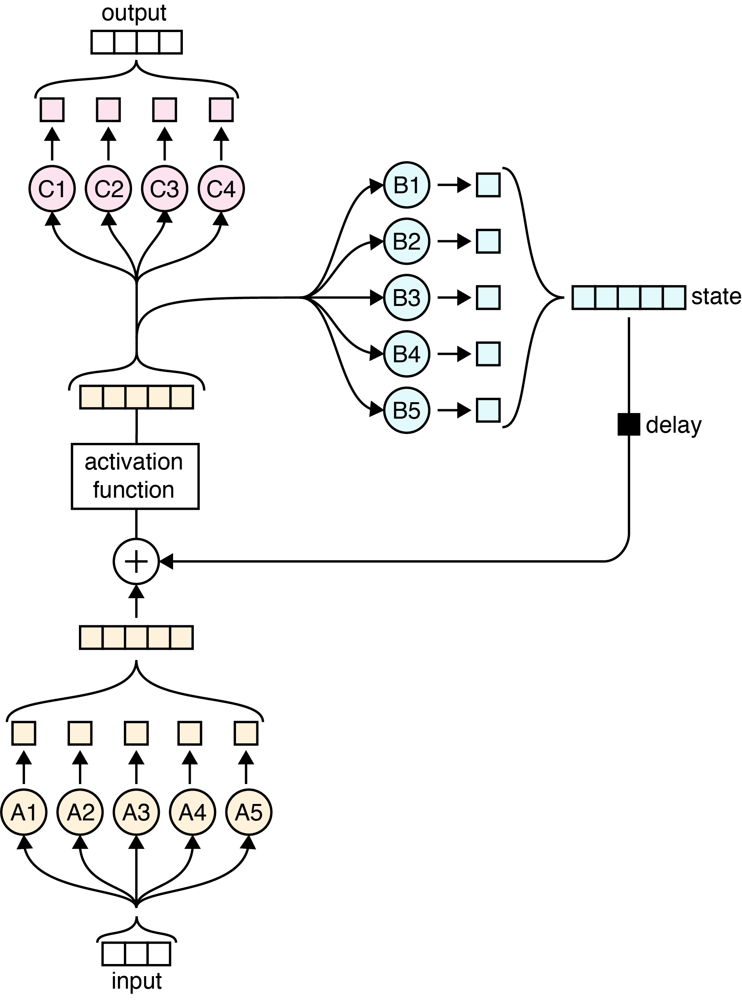
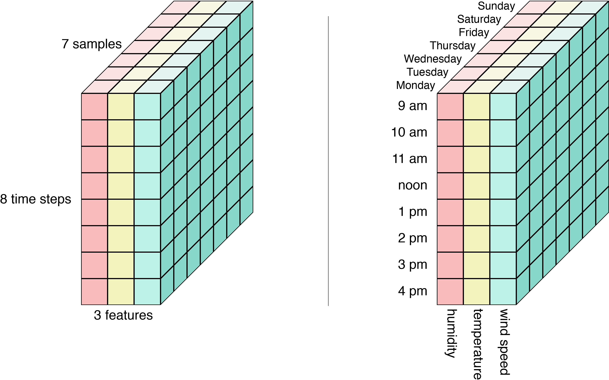
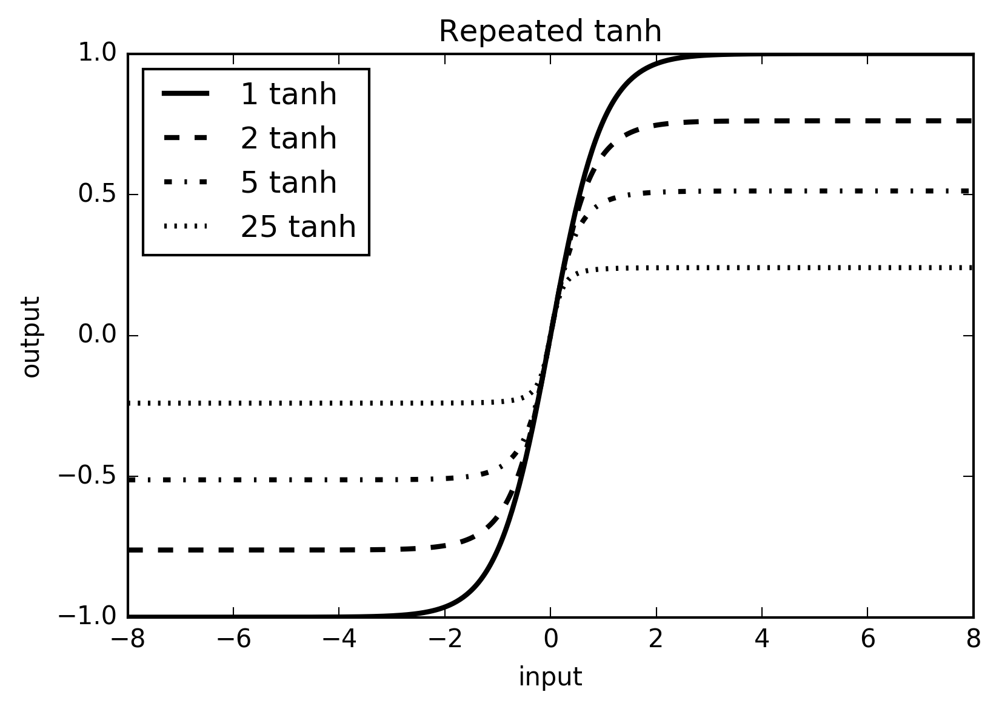
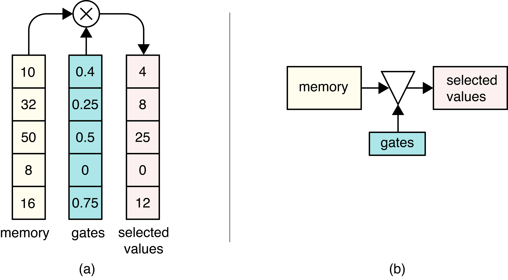

footer: univ.ai
autoscale: true

#[fit] Language and
#[fit] Other Temporal things
#[fit] Recurrent Nets


---


## Language Modeling

Predict the next word. We'll start with random "weights" for the embeddings and other parameters and run SGD. How do we set up a training set?


---

## Dealing with Sequences




This is a windowed dataset, with a window of size 4 and overlapping windows


---

## Fitting with a MLP


But now, order does not matter! So the model on the right gives equivalent results.



---

## The idea of state




Consider a robot that repairs phones using parts from a part box. As time progresses, the state of the parts box changes. This is the idea behind the simple RNN.

---

## Updating state


---

## Structure of a SimpleRNN



Input size: 3, State size: 5, Output size: 4

"*An input of 3 values is processed simultaneously by five neurons lettered A to create a list of 5 values. This is added, element by element, to the state. This result then goes through five neurons lettered B to create a new state, which then goes into the delay step. The result of the addition also goes into the 4 neurons lettered C to produce an output.*"

(Glassner, Andrew. Deep Learning, Vol. 2: From Basics to Practice)

---


---

## Outputs from RNNs


---

- **one to many** structure takes in a single piece of data and produces a sequence. 

- **many to one** structure reads in a sequence and gives us back a single value. e.g. sentiment analysis

- **many to many** structures are in some ways the most interesting. Delays are useful in translation. For example, English: “T*he black dog jumped over the cat*”  to Italian “*Il cane nero saltò sopra il gatto*”
Other examples include video description and movement classification.

---

## Keras example

```python
max_features = 10000
maxlen = 500
batch_size = 32

(input_train, y_train), (input_test, y_test) = imdb.load_data(num_words=max_features)
input_train = sequence.pad_sequences(input_train, maxlen=maxlen)
input_test = sequence.pad_sequences(input_test, maxlen=maxlen)

model = Sequential() 
model.add(Embedding(max_features, 32)) 
model.add(SimpleRNN(32)) 
model.add(Dense(1, activation='sigmoid'))
```

---

## How is data fed to Keras?



---

## Training a RNN

Backprop in a RNN is called Back Propagation Through Time (BPTT). First unroll the network and backprop like a regular MLP


---

## Problems



- repeated application of non-linearities lead to 0 gradients and no learning.
- The dynamic range of the network is also reduced.
- This problem happens in deep CNNs as well, and has many solutions
- The finiteness of the RNN memory means that not enough state may be propagating through. This is called that **Long Term Dependency Problem**.


---

## From Simple RNNs to LSTMs

 

 

---

## The main idea behind LSTM


- takes short term memory and makes it longer
- The key is the cell state, the horizontal line running through the top of the diagram.
- memory runs straight down the entire chain
- a key innovation is the gate, which only allows partial information through

---

## Gates


Values calculated through a regression and a sigmoid regulate "How much of a number" comes through..

---


## The forget gate


---

# Remembering.

- a sigmoid layer called the “input gate layer” $$i_t$$ that decides which values we’ll update.
- a tanh layer creates a vector of new candidate values, $$\tilde{C}_t$$ that could be added to the state. 


---

# How is the state updated?


Multiply old state $$C_{t-1}$$ by $$f_t$$ to forget things, then add that to $$\tilde{C}_t$$, the new candidate value, multiplied by $$i_t$$


---

## The output or selected values




Output is a filtered version of the cell state. First, sigmoid to decide what parts of the cell state to output. Then multiply by tanh(cell_state).

---

## GRU


Combines forget and input gates into single “update gate.” Merges the cell state and hidden state. Faster. Try Both.

---

## Keras Example

```python
max_features = 10000
maxlen = 500
batch_size = 32

(input_train, y_train), (input_test, y_test) = imdb.load_data(num_words=max_features)
input_train = sequence.pad_sequences(input_train, maxlen=maxlen)
input_test = sequence.pad_sequences(input_test, maxlen=maxlen)

model = Sequential() 
model.add(Embedding(max_features, 32)) 
model.add(LSTM/GRU/CuDNNLSTM/CuDNNGRU(32)) 
model.add(Dense(1, activation='sigmoid'))
```


